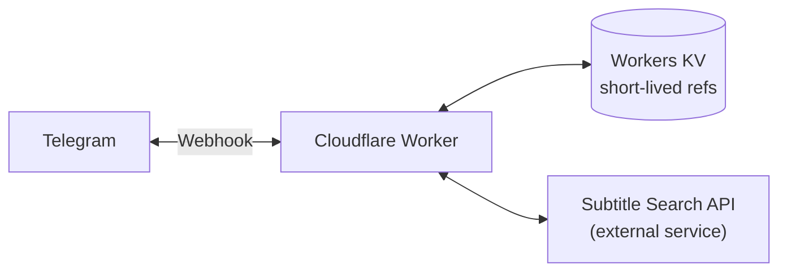
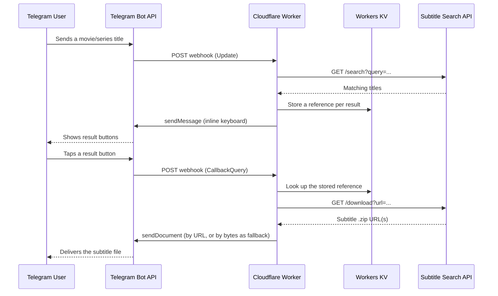

# Telegram Persian Subtitle Bot

A serverless Telegram bot, built for **Cloudflare Workers**, that lets users search for and download **Persian subtitles** for movies and TV series directly inside a Telegram chat.

[](https://developers.cloudflare.com/workers/)
[](https://github.com/your-username/telegram-persian-subtitle-bot/actions/workflows/ci.yml)
[](LICENSE)
[](https://nodejs.org/)
[](CONTRIBUTING.md)

> **Note:** replace `your-username` above with your actual GitHub username/organization once you push this repository.

## Table of Contents

- [Overview](#overview)
- [Features](#features)
- [How It Works](#how-it-works)
- [Project Structure](#project-structure)
- [Prerequisites](#prerequisites)
- [Getting Started](#getting-started)
- [Configuration](#configuration)
- [Companion Search API](#companion-search-api)
- [Deploying to Cloudflare Workers](#deploying-to-cloudflare-workers)
- [Setting the Telegram Webhook](#setting-the-telegram-webhook)
- [Usage](#usage)
- [Local Development](#local-development)
- [Debug Endpoints](#debug-endpoints)
- [Testing](#testing)
- [Environment Variables Reference](#environment-variables-reference)
- [Security Notes](#security-notes)
- [Limitations](#limitations)
- [Roadmap](#roadmap)
- [Contributing](#contributing)
- [License](#license)
- [Disclaimer](#disclaimer)

## Overview

This project is a Telegram bot that:

1. Accepts a movie/series title from a Telegram user.
2. Searches a companion "subtitle search" HTTP API for matches.
3. Shows the results as tappable inline-keyboard buttons.
4. When a title is selected, resolves the downloadable subtitle archive(s) and sends the `.zip` file straight into the chat.

The bot itself runs entirely on **Cloudflare Workers** — there is no server to provision or keep running. It uses **Workers KV** as lightweight, short-lived storage for callback state (Telegram limits button payloads to 64 bytes, so full URLs can't be embedded directly in a button).

This repository contains **only the Telegram bot**. It depends on a separate, external HTTP API to actually perform the subtitle search/scraping — see [Companion Search API](#companion-search-api) for the contract that service must implement.

## Features

- 🔎 **Inline search** — type a title, get a list of matching results as buttons.
- 📄 **Pagination** — a "Show more results" button fetches additional matches beyond the first page.
- 🎬 **Multi-version support** — if a title has several subtitle archives available, the bot lets the user choose which one to download.
- 📦 **Reliable delivery** — tries the fast "send by URL" path first, and automatically falls back to downloading and re-uploading the file if Telegram can't fetch the source URL directly.
- 🔐 **Webhook verification** — validates Telegram's secret token header on every request.
- 🛠️ **Built-in diagnostics** — protected `/debug/*` endpoints to check outbound connectivity from the Workers runtime.
- 🧪 **Unit tested** — core text-processing utilities are covered by a Vitest test suite.
- ⚡ **Zero infrastructure** — deploys as a single Cloudflare Worker plus one KV namespace.

## How It Works



A typical search-and-download flow looks like this:



Every button's `callback_data` is a short id (e.g. `m:a1b2c3d4e5f6`) pointing at a JSON blob cached in Workers KV for 30 minutes — long enough for a user to browse results, short enough to keep storage usage minimal.

## Project Structure

```
telegram-persian-subtitle-bot/
├── .github/
│   └── workflows/
│       ├── ci.yml            # Runs tests + format check on every push/PR
│       └── deploy.yml        # Deploys the Worker to Cloudflare on push to main
├── src/
│   ├── index.js               # Worker entry point / HTTP routing
│   ├── handlers.js            # Bot logic: message & callback-query handling
│   ├── telegram.js            # Telegram Bot API client
│   ├── scraper.js             # Client for the external subtitle search API
│   ├── kv.js                  # Workers KV helper for short-lived references
│   ├── messages.js            # All user-facing bot text, in one place
│   └── debug.js                # Outbound-connectivity diagnostic checks
├── tests/
│   └── utils.test.js          # Unit tests for src/utils.js
├── .dev.vars.example          # Template for local secrets (wrangler dev)
├── .editorconfig
├── .gitignore
├── .prettierrc.json
├── CONTRIBUTING.md
├── LICENSE
├── package.json
├── README.md
├── vitest.config.js
└── wrangler.jsonc             # Cloudflare Workers configuration
```

> `src/utils.js` (pure helper functions — HTML escaping, truncation, id generation, etc.) is imported by several of the modules above; see the file itself for details.

## Prerequisites

- [Node.js](https://nodejs.org/) **22 or later** and npm.
- A [Cloudflare account](https://dash.cloudflare.com/sign-up) (the free tier is sufficient — Workers and KV both have generous free quotas).
- A Telegram bot token from [@BotFather](https://t.me/BotFather).
- A running instance of a compatible subtitle search API — see [Companion Search API](#companion-search-api). This is **not** included in this repository.

## Getting Started

```bash
git clone https://github.com/your-username/telegram-persian-subtitle-bot.git
cd telegram-persian-subtitle-bot
npm install
```

## Configuration

The bot is configured through Cloudflare Workers **secrets** (sensitive values, never committed to the repo) and **vars** (plain configuration, stored in `wrangler.jsonc`).

| Name                      | Kind         | Required    | Purpose                                                                                     |
| ------------------------- | ------------ | ----------- | --------------------------------------------------------------------------------------------- |
| `TELEGRAM_BOT_TOKEN`      | secret       | Yes         | Bot token issued by @BotFather.                                                              |
| `TELEGRAM_WEBHOOK_SECRET` | secret       | Recommended | Arbitrary random string; Telegram echoes it back on every webhook call so the Worker can reject forged requests. |
| `SETUP_TOKEN`             | secret       | Yes         | Arbitrary random string that gates the `/setup` and `/debug/*` endpoints.                     |
| `SUBTITLE_API_URL`        | var          | Yes         | Base URL of your companion subtitle search API (see below).                                   |
| `SUBS_KV`                 | KV binding   | Yes         | Workers KV namespace used for short-lived callback references.                                |

See [Deploying to Cloudflare Workers](#deploying-to-cloudflare-workers) for exactly how to set each of these.

## Companion Search API

This bot is a thin Telegram-facing layer. All of the actual subtitle searching/scraping happens in a **separate service** that you host yourself and point the bot at via `SUBTITLE_API_URL`. That service is **not part of this repository** — you can implement it in whatever language or platform you like, as long as it exposes the two endpoints below.

### `GET /search`

| Query param | Required | Description                                  |
| ----------- | -------- | --------------------------------------------- |
| `query`     | Yes      | Free-text search term (movie/series title).   |
| `language`  | No       | Currently always sent as `per` (Persian).     |
| `limit`     | No       | Maximum number of results to return.          |

**Response body:**

```json
{
  "results": [
    {
      "title": "Download Persian Subtitle for Movie: Example Title",
      "url": "https://source-site.example/subtitle/example-title",
      "download_url": "https://source-site.example/dlsub/example-title.zip"
    }
  ]
}
```

- `title` — display title. The bot strips a known Persian prefix pattern from it before showing it as a button label (see `cleanTitle` in `src/utils.js`); adjust that pattern if your source site uses different wording.
- `url` — canonical page URL; passed back into `/download` when the user selects this result.
- `download_url` — optional. If your search endpoint can already resolve a direct download link, include it here; the bot doesn't currently read this field directly, but keeping it available makes the contract easier to extend.

### `GET /download`

| Query param | Required | Description                                          |
| ----------- | -------- | ------------------------------------------------------ |
| `url`       | Yes      | The `url` value from a `/search` result.               |

**Response body:**

```json
{
  "urls": ["https://source-site.example/dlsub/example-title.zip"]
}
```

- `urls` — one or more direct, publicly reachable `.zip` download links. If there's exactly one, the bot downloads and sends it immediately. If there are several, the bot lets the user pick which version to receive.

## Deploying to Cloudflare Workers

1. **Authenticate Wrangler** (opens a browser window):

   ```bash
   npx wrangler login
   ```

2. **Create the KV namespace** used for callback references:

   ```bash
   npx wrangler kv namespace create SUBS_KV
   npx wrangler kv namespace create SUBS_KV --preview
   ```

   Each command prints an `id`. Copy them into the `kv_namespaces` block of `wrangler.jsonc`, replacing the placeholder values.

3. **Point the bot at your companion search API** by editing the `vars.SUBTITLE_API_URL` value in `wrangler.jsonc`.

4. **Set the required secrets** (you'll be prompted to paste each value):

   ```bash
   npx wrangler secret put TELEGRAM_BOT_TOKEN
   npx wrangler secret put TELEGRAM_WEBHOOK_SECRET
   npx wrangler secret put SETUP_TOKEN
   ```

5. **Deploy:**

   ```bash
   npm run deploy
   ```

   Wrangler prints the Worker's public URL, e.g. `https://telegram-persian-subtitle-bot.<your-subdomain>.workers.dev`.

To deploy automatically from GitHub Actions instead, add `CLOUDFLARE_API_TOKEN` and `CLOUDFLARE_ACCOUNT_ID` as repository secrets — see `.github/workflows/deploy.yml`.

## Setting the Telegram Webhook

Once deployed, tell Telegram where to send updates by calling the built-in `/setup` endpoint (protected by `SETUP_TOKEN`):

```bash
curl "https://<your-worker>.workers.dev/setup?token=<SETUP_TOKEN>&webhook=https://<your-worker>.workers.dev/"
```

A successful response looks like:

```json
{ "ok": true, "result": true, "description": "Webhook was set" }
```

To remove the webhook (e.g. before switching to local development with long polling):

```bash
curl "https://<your-worker>.workers.dev/setup?token=<SETUP_TOKEN>&mode=delete"
```

## Usage

From a user's perspective, interacting with the bot looks like this:

1. Send `/start` or `/help` to see the welcome message.
2. Send a movie or series title (Persian or English), e.g. `Supergirl`.
3. Tap a result button to select that title.
   - If multiple subtitle versions exist, tap again to choose the specific one.
4. The bot sends the `.zip` subtitle file directly in the chat.
5. If there were more matches than fit on one screen, tap **"Show more results"** to see additional titles.

## Local Development

```bash
cp .dev.vars.example .dev.vars
# then edit .dev.vars with real values
npm run dev
```

`wrangler dev` starts a local server, but Telegram's servers can't reach `localhost` directly. To test webhook delivery locally, expose your local server with a tunneling tool (for example [`cloudflared tunnel`](https://developers.cloudflare.com/cloudflare-one/connections/connect-networks/downloads/) or `ngrok`), then point a **test bot's** webhook at the resulting public URL using the `/setup` endpoint described above. Using a separate bot/token for local development is recommended so you don't disrupt your production bot's webhook.

## Debug Endpoints

Three lightweight, `SETUP_TOKEN`-protected endpoints help diagnose connectivity issues from the Workers runtime:

| Endpoint               | Checks                                                  |
| ----------------------- | -------------------------------------------------------- |
| `/debug/external`       | General outbound HTTPS connectivity from the Worker.      |
| `/debug/telegram`       | That `TELEGRAM_BOT_TOKEN` is valid and Telegram is reachable. |
| `/debug/subtitle-api`   | That `SUBTITLE_API_URL` is configured and reachable.       |

```bash
curl "https://<your-worker>.workers.dev/debug/telegram?token=<SETUP_TOKEN>"
```

## Testing

```bash
npm test        # run the test suite once
npm run test:watch  # re-run on file changes
```

The current suite covers the pure text-processing helpers in `src/utils.js` (HTML escaping, label truncation, title cleanup, filename extraction, id generation). Contributions adding coverage for `handlers.js` (with `telegram.js`/`scraper.js` mocked out) are very welcome — see [Roadmap](#roadmap).

## Environment Variables Reference

| Variable                  | Where it's set                          | Example                                  |
| -------------------------- | ---------------------------------------- | ------------------------------------------ |
| `TELEGRAM_BOT_TOKEN`       | `wrangler secret put` / `.dev.vars`      | `123456789:AAExampleBotTokenHere`          |
| `TELEGRAM_WEBHOOK_SECRET`  | `wrangler secret put` / `.dev.vars`      | a random 32+ character string              |
| `SETUP_TOKEN`              | `wrangler secret put` / `.dev.vars`      | a random 32+ character string              |
| `SUBTITLE_API_URL`         | `wrangler.jsonc` → `vars`                | `https://your-subtitle-search-api.example.com` |

## Security Notes

- Never commit real values for `TELEGRAM_BOT_TOKEN`, `TELEGRAM_WEBHOOK_SECRET`, or `SETUP_TOKEN`. `.dev.vars` is git-ignored for this reason — only `.dev.vars.example` (with placeholders) is tracked.
- Setting `TELEGRAM_WEBHOOK_SECRET` is optional but strongly recommended: without it, anyone who discovers your Worker's URL could POST fabricated updates to it.
- `/setup` and every `/debug/*` route require a matching `SETUP_TOKEN` query parameter — treat this token like a password and rotate it if it ever leaks (e.g., in logs or a shared URL).
- User-supplied text (search queries) is HTML-escaped before being embedded in Telegram messages sent with `parse_mode: "HTML"`, to prevent formatting/markup injection.

## Limitations

- **File size** — standard Telegram Bot API file-size limits apply to subtitle uploads; see the [Telegram Bot API documentation](https://core.telegram.org/bots/api#senddocument) for current limits.
- **KV consistency** — Workers KV is eventually consistent. In rare cases, a value written immediately before a read (across different Cloudflare locations) may not yet be visible. This has not been an issue in practice given the bot's read-after-write pattern within a single request lifecycle, but it's worth knowing about.
- **Reference TTL** — callback references (search results, download links) expire after 30 minutes (`TTL_SECONDS` in `src/kv.js`). Tapping an old button after that window returns an "expired" message and the user needs to search again.
- **External dependency** — search and download resolution depend entirely on the companion API described above, which this repository does not implement or host.
- **No rate limiting** — the bot does not currently throttle per-user request rates; see [Roadmap](#roadmap).

## Roadmap

Ideas for future contributions:

- [ ] Per-user rate limiting / flood protection.
- [ ] Cache recent search results in KV to reduce load on the companion API.
- [ ] Structured logging (e.g., to Cloudflare Logpush or a `wrangler tail`-friendly format).
- [ ] Configurable UI language (English/Persian toggle) instead of a single fixed language.
- [ ] Integration tests for `handlers.js` using mocked `telegram.js`/`scraper.js`.
- [ ] Optional inline mode (`@YourBot movie name` from any chat).

Contributions implementing any of the above are welcome — see [Contributing](#contributing).

## Contributing

Contributions, issues, and feature requests are welcome. Please see [CONTRIBUTING.md](CONTRIBUTING.md) for setup instructions and guidelines before opening a pull request.

## License

This project is licensed under the [MIT License](LICENSE).

## Disclaimer

This project is provided for **educational purposes**. It is your responsibility to ensure that:

- Your use of any subtitle source/companion API complies with that site's Terms of Service.
- Your use of this bot complies with applicable copyright law and Telegram's [Terms of Service](https://telegram.org/tos) in your jurisdiction.

The maintainers of this repository do not host, scrape, or distribute any subtitle content themselves — this repository contains only the Telegram-facing bot code.
